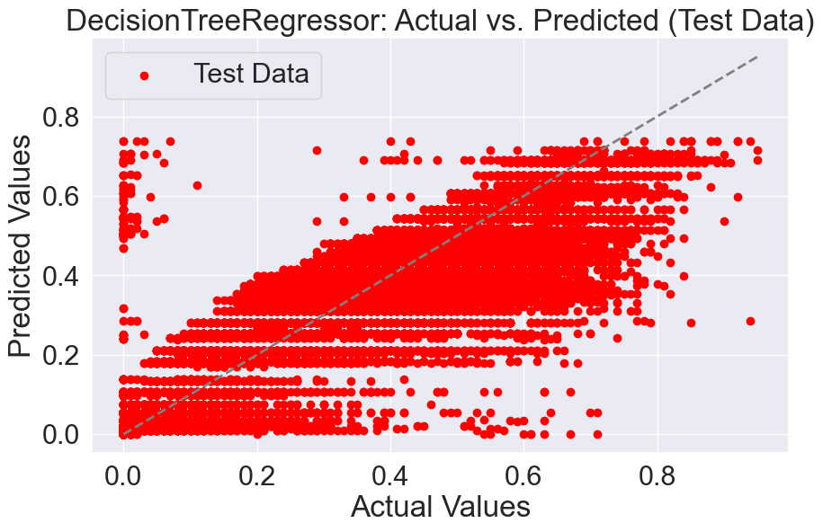
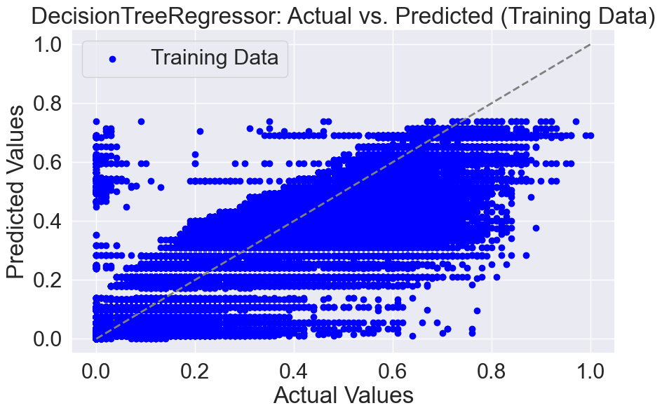

# PROJECT TITLE 

# Music recommendation system

## NON-TECHNICAL EXPLANATION OF YOUR PROJECT
<!-- 100 words to explain what your project is about to a general audience.  -->

This project is designed to enhance music discovery by recommending songs based on user preferences. Leveraging the expansive Spotify dataset covering tracks from 1921 to 2020, the system offers personalized song suggestions. Whether you input a favorite song or express your musical taste, the algorithm identifies and suggests the top 10 similar songs. This recommendation system aims to make music exploration enjoyable and effortless, providing users with a curated selection that aligns with their unique musical inclinations.

## DATA
<!-- A summary of the data you’re using, remembering to include where you got it and any relevant citations.  -->

### Dataset Overview

#### Source
This project leverages a publicly available dataset from Spotify, enriched further using Spotipy, a Python client for the Spotify Web API. Spotipy facilitates easy data fetching and querying of Spotify's extensive catalog for songs.

#### Features Description

1. **track_id:**
   The Spotify ID for the track.

2. **artists:**
   Names of the artists who performed the track. Multiple artists are separated by a semicolon (;).

3. **album_name:**
   The album name in which the track appears.

4. **track_name:**
   Name of the track.

5. **popularity:**
   Popularity score ranging from 0 to 100, calculated algorithmically based on total plays and recency. Reflects the track's current popularity.

6. **duration_ms:**
   The track length in milliseconds.

7. **explicit:**
   Indicates whether the track has explicit lyrics (true = yes; false = no or unknown).

8. **danceability:**
   Describes the suitability of a track for dancing based on tempo, rhythm stability, beat strength, and overall regularity. Ranges from 0.0 (least danceable) to 1.0 (most danceable).

9. **energy:**
   Represents perceptual intensity and activity, ranging from 0.0 to 1.0. High energy suggests a fast, loud, and noisy track.

10. **key:**
    Represents the key the track is in, mapped to pitches using standard Pitch Class notation. -1 indicates no detected key.

11. **loudness:**
    Overall loudness of a track in decibels (dB).

12. **mode:**
    Indicates the modality (major or minor) of a track, with 1 for major and 0 for minor.

13. **speechiness:**
    Detects the presence of spoken words in a track. Values above 0.66 suggest speech-like recordings, while below 0.33 likely represent music.

14. **acousticness:**
    Confidence measure (0.0 to 1.0) of whether the track is acoustic. Higher values indicate higher confidence in acoustic nature.

15. **instrumentalness:**
    Predicts whether a track contains no vocals. Values closer to 1.0 suggest instrumental content.

16. **liveness:**
    Detects the presence of an audience in the recording. Higher values indicate a higher probability of a live performance.

17. **valence:**
    Measures musical positiveness on a scale from 0.0 to 1.0. High valence indicates a positive mood.

18. **tempo:**
    Estimated tempo of a track in beats per minute (BPM).

19. **time_signature:**
    An estimated time signature indicating the number of beats in each bar, ranging from 3 to 7.

20. **track_genre:**
    The genre to which the track belongs.

#### Citation
Please note that the Spotify dataset and Spotipy library are publicly available resources, and appropriate credit and adherence to their terms of use are recommended. Refer to the official Spotify API documentation and Spotipy documentation for more details.

## MODEL 
<!-- A summary of the model you’re using and why you chose it.  -->

The model employed in this project is a content-based filtering recommender system utilizing cosine distances, which aligns with a content-based recommendation approach. The utilization of cosine distance signifies that the system suggests songs with feature vectors closely resembling the central song, thereby implementing a similarity-based recommendation strategy. This approach enhances the relevance of recommendations by focusing on the inherent characteristics and attributes of the songs, contributing to a more personalized and accurate recommendation system.

## HYPERPARAMETER OPTIMSATION
GridSearch is employed to find the optimal hyperparameters for a DecisionTreeRegressor. The hyperparameters considered in the grid search are:

1. **max_depth**: Defines the maximum depth of the decision tree.
2. **max_leaf_nodes**: Specifies the maximum number of leaf nodes in the tree.
3. **max_features**: Determines the maximum number of features considered for splitting a node.
4. **min_samples_split**: Sets the minimum number of samples required to split an internal node.
5. **min_samples_leaf**: Establishes the minimum number of samples needed to form a leaf node.

The grid search is conducted using a predefined set of values for each hyperparameter. The parameter grid is constructed with various options for each hyperparameter, and the GridSearchCV is employed with 5-fold cross-validation.

The model is evaluated using the best hyperparameters on both the training and test sets. The performance metrics, including training r^2 score, test r^2 score, mean absolute error, and the best parameters from the grid search. This process ensures that the Decision Tree Regressor achieves optimal predictive performance by carefully tuning its key characteristics.


## RESULTS

## Hyperparameter Optimization using Grid Search

During the hyperparameter tuning process for the DecisionTreeRegressor, an exhaustive GridSearch was performed to identify the optimal set of hyperparameters. The goal was to enhance the model's predictive performance by systematically exploring various combinations of hyperparameter values.

The search space included parameters such as 'max_depth,' 'max_features,' 'max_leaf_nodes,' 'min_samples_leaf,' and 'min_samples_split.' The grid search yielded the following optimal hyperparameter configuration:

```python
{'max_depth': 11, 'max_features': 'auto', 'max_leaf_nodes': 120, 'min_samples_leaf': 1, 'min_samples_split': 2}
```

These hyperparameters represent the configuration that resulted in the best model performance according to the chosen evaluation metric.

## Performance Metrics with Optimized Hyperparameters

After applying the determined optimal hyperparameters to the DecisionTreeRegressor, the model's performance was assessed using key metrics. The following results were obtained:

- **Mean Absolute Error (MAE):** 0.069
- **R2 Score (Training Data):** 0.802
- **R2 Score (Test Data):** 0.797

These metrics provide insights into the model's accuracy, capturing both the absolute error and the explained variance in the training and test datasets. The achieved values showcase the effectiveness of the hyperparameter optimization process in enhancing the overall performance of the DecisionTreeRegressor.

# Test data result


# Training data result 


## (OPTIONAL: CONTACT DETAILS)
If you are planning on making your github repo public you may wish to include some contact information such as a link to your twitter or an email address. 

